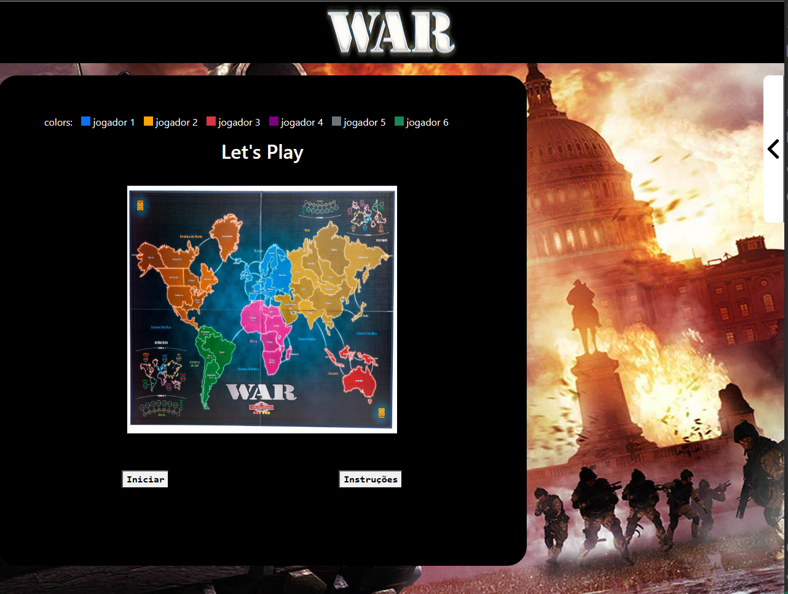

# War

**Número da Lista**: 13 
**Conteúdo da Disciplina**: Grafos1 

## Alunos
|Matrícula | Aluno |
| -- | -- |
| 20/0028367  |  Victor Hugo Oliveira Leão |
| 20/0028677  |  Vitor Manoel Aquino de Brito |

## Sobre 

O projeto desenvolvido foi uma adaptação mais simples do jogo [War](https://www.youtube.com/watch?v=gOH3lXcDrEA) de tabuleiro para um aplicação Web. Basicamente, jogadores recebem territórios (os alocam com tropas) e, a partir da mecânica de ataques a territórios inimigos adjacentes, devem conquistar seus objetivos (distribuídos de forma aleatória no começo do jogo) para vencer o jogo.

A principal ligação entre o projeto e o conteúdo foi a de distribuir o mapa (territórios e fronteiras) como um grafo, em que cada território seria um nó/vértice do grafo e as fronteiras, as arestas do grafo. Assim, para a mecânica de ataques, por exemplo, analisa-se os territórios para ataque e os seus vizinhos possíveis. Ademais, um algoritmo de busca (BFS) é aplicado com o intuito de verificar se todo um território é obtido por um jogador só (recebe um bônus de tropas para alocar).

Vídeo para apresentação do projeto feito pela dupla:

## Screenshots
Adicione 3 ou mais screenshots do projeto em funcionamento.

</img>
</img>
</img>
</img>
</img>

Mais fotos em [Imagens extras](./assets/Fotos.md)

## Instalação 
**Linguagem**: JavaScript 
**Framework**: Angular 

# War

Para rodar o projeto é necessário ter o Angular e o [NodeJs](https://nodejs.org/en) instalados na máquina.

Este projeto foi gerado utilizando  [Angular CLI](https://github.com/angular/angular-cli) version 15.2.6.

Depois de realizar a instalação de ambos é necessário rodar o comando:

`npm install`

## Development server

Rode o comando `ng serve` para iniciar o servidor em ambiente de desenvolvimento. Navegue para `http://localhost:4200/`. A aplicação irá automaticamente recarregar se você fizer qualquer mudança nos arquivos.

## Uso 

O uso é bem simples, basta clicar no botão de iniciar jogo na interface inicial da aplicação e começar a jogar.

## Outros 

A dupla trabalhou da seguinte maneira:

1. O membro Victor Hugo Oliveira Leão trabalhou na implementação do backend do projeto na branch [feature/backend](https://github.com/projeto-de-algoritmos/Grafos1_War/tree/feature/backend), buscando entender as principais funções e implementações que o jogo necessitaria, como, por exemplo, o mapeamento do grafo, BFS, mecânicas de alocação de tropas, ataques etc. Essa parte foi feita e testada para uma aplicação de uso no terminal, não sendo, então, 100% entregue para o código final.
2. Enquanto isso, o membro Vitor Manoel Aquino de Brito estava trabalhando na aplicação do frontend na branch [feature/front](https://github.com/projeto-de-algoritmos/Grafos1_War/tree/feature/front), implementando o jogo de forma Web (visualização do mapa e interação dos usuários de forma mais apresentável) e integrando as mecânicas que eram desenvolvidas.

Dessa forma, os commits feitos que refletem os trabalhos dos membros podem ser realmente vistos nessas branchs. Além disso, foram feitas algumas issues para poder guiar o desenvolvimento dos membros: [Issues](https://github.com/projeto-de-algoritmos/Grafos1_War/issues).
